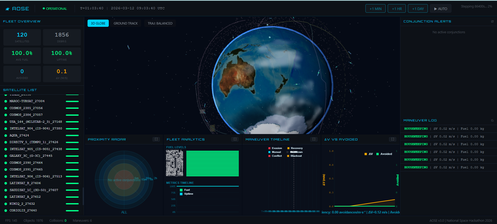

# Team MindMatrix - Video Demonstration Script (3-4 Minutes)

Use this exact script while recording. Focus is live website demo first, documentation second.

## Total Duration Target

- 3 minutes 20 seconds to 3 minutes 50 seconds

## 00:00 - 00:25 | Opening + Problem Statement (Short)

Action:
- Show dashboard already running at http://127.0.0.1:8000/

Say exactly:
- The problem is space is getting crowded with active satellites and debris, so collision risk is increasing and manual handling does not scale.
- We track satellites and space debris, predict possible collisions, and automatically plan safe movements while saving fuel.

## 00:25 - 01:10 | Live Data + Fleet View

Action:
- Point to Fleet Overview counters.
- Point to Satellite List and Debris count.

Say exactly:
- This is our live Orbital Insight dashboard.
- Here we can see active satellites, debris objects, fuel and uptime metrics, and maneuver outcomes.
- The system continuously updates state and keeps mission operators aware of constellation health in real time.

## 01:10 - 01:55 | Satellite-Focused Demonstration

Action:
- Click one satellite from the Satellite List.
- Keep selection visible for a few seconds.
- Highlight that selected orbit/related data gets focus in views and panels.

Say exactly:
- Now I select a specific satellite to shift from fleet-level monitoring to object-level operations.
- Once selected, the dashboard focuses on that satellite’s trajectory and mission context.
- This is important for rapid decision-making when an operator needs object-specific awareness.

## 01:55 - 02:35 | Controls + Time Evolution (Proof of Simulation)

Action:
- Click +1 MIN, then +1 HR.
- Turn AUTO on for a few seconds, then STOP.
- Optionally click +1 DAY once.

Say exactly:
- These controls advance simulation time and trigger backend propagation.
- AUTO mode continuously runs the simulation while keeping UI control responsive.
- Long steps are handled safely, so the system avoids overlapping calls and remains stable during operations.

## 02:35 - 03:00 | Globe + Ground Track + Radar Panels

Action:
- Switch between 3D GLOBE and GROUND TRACK.
- Point at Proximity Radar, Maneuver Log, and charts.

Say exactly:
- We provide both 3D and map views for spatial awareness.
- The radar and alert panels support conjunction interpretation.
- In alerts, WARNING is mainly driven by close miss distance, so near passes are highlighted early.
- Collision probability shown as Pc is the statistical risk estimate; even very small Pc means low true impact likelihood despite a close pass.
- Maneuver and analytics panels show operational impact, including delta-v and avoided-risk trends.

## 03:00 - 03:15 | Very Short Architecture Reference

Action:
- Briefly show architecture section from README (5-8 seconds only).

Say exactly:
- Architecture is API layer, simulation engine, physics modules, and data ingestion feeding this live dashboard.

## 03:15 - 03:35 | Full Workflow (Say Exactly)

Say exactly:
- 🔁 11. Full Workflow (SUPER IMPORTANT)
- This is your BEST explanation:
- Get satellite data
- Predict positions
- Find nearby objects
- Calculate risk
- Plan maneuver
- Apply movement
- Repeat
- I will say this confidently because this is the core autonomous loop of our system.

## 03:35 - 03:50 | Strengths + Ending (Say Exactly)

Say exactly:
- 🧠 12. What makes our project strong?
- Real-time tracking ✅
- Scalable (KD-tree) ✅
- Physically accurate (J2, RK4) ✅
- Practical constraints (fuel, cooldown) ✅
- Automation + control ✅

---

## Quick Delivery Tips

- Keep mouse movement slow and intentional.
- Do not over-explain equations during the demo; show behavior first.
- If no active conjunction appears at that second, say that fast-forward reveals events over time.
